# SnapKitty Redbook

> *Evidence begins where silence ends.*

[](https://snapkittywest.github.io/snapkitty-redbook/)

## Interactive Trust Book

A cinematic digital book where the page turns while a SnapKitty agent reads the text out loud, highlights key passages, and triggers visual effects as the story unfolds.

**[Read the Book →](https://snapkittywest.github.io/snapkitty-redbook/)**

## What's Inside

| Chapter | Title | Seal |
|---------|-------|------|
| 01 | The Covenant Opens | Ω↺Ψ↺Δ↺Λ↺Σ↺Φ↺α |
| 02 | Trust Architecture | Ω↺TR↺UST↺ARCH↺ |
| 03 | The WORM Seal | Ω↺WR↺OM↺SEAL↺ |
| 04 | Linear Types | Ω↺LN↺RTyp↺ES↺ |
| 05 | Agent Governance | Ω↺AG↺TNCE↺ |
| 06 | Evidence or Silence | Ω↺EV↺ID↺ENCE↺OR↺SILENCE |

## Agents

| Agent | Role | Voice |
|-------|------|-------|
| **BOB** | Oracle narrator | CEO |
| **NOVA** | Poetic narrator | CTO |
| **CARTO** | Legal narrator | CFO |
| **ENKI** | Knowledge keeper | COO |
| **SENTINEL** | Security narrator | CISO |

## Visual Modes

- Classic Book Mode
- Terminal Book Mode
- Sacred Geometry Mode
- Courtroom Evidence Mode
- Matrix Archive Mode

## The Core Doctrine

> **Ω** Evidence or Silence.
> You may claim anything. But if you cannot provide evidence — a sealed, verifiable, timestamped artifact — then you must be silent.

## Links

- [C-Suite Dashboard](csuite.html)
- [Paper (DOI)](https://doi.org/10.5281/zenodo.21132094)
- [ORCID](https://orcid.org/0009-0006-1916-5245)
- [SNAPKITTYWEST](https://github.com/SNAPKITTYWEST)

---

```
╔══════════════════════════════════════╗
║        SNAPKITTY REDBOOK             ║
║      INTERACTIVE TRUST BOOK          ║
╠══════════════════════════════════════╣
║  MODE: READ ALOUD                    ║
║  AGENT: BOB                          ║
║  STATUS: WORM-SEALED                 ║
║  SEAL: Ω EVIDENCE OR SILENCE         ║
╚══════════════════════════════════════╝
```
